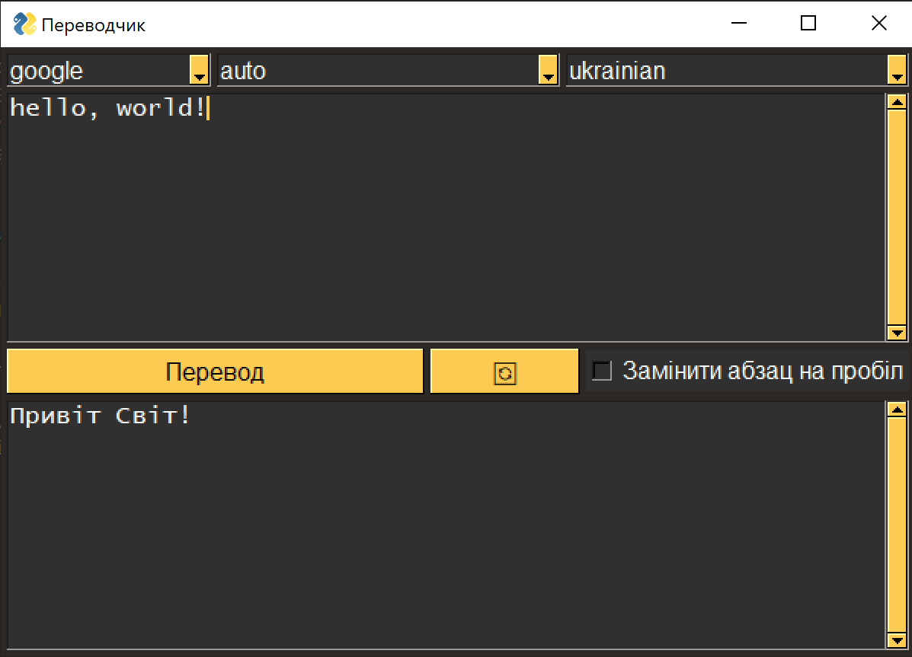

# Python_Desktop-programs

1. Автоклікер (autoclicker)

у 16 рядку стоїть обмеження 1 клік в 0.1 секунду, можна його зняти.
Результат кілків на сатйті:


2. Программа для видалення стім ігр з комп'ютера (dotadella)

Скрипт який видалаяє ігри із папки стіму.
У 7 рядку программи можна налаштувати ігру

```python
GAME = "dota 2 beta"
```

3. Переводщик (Text-Translator)

Программа переводщик із усіма відомими сервісами та графічним інтерфейсом



4. Фотошоп (Image processing)

інтерфейс та основні функції:


Фільтри:


Налаштування:

